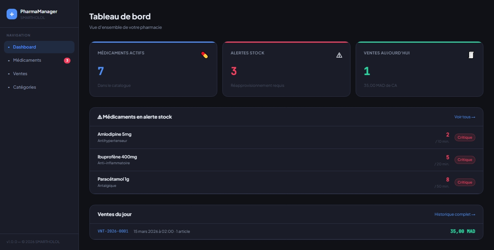
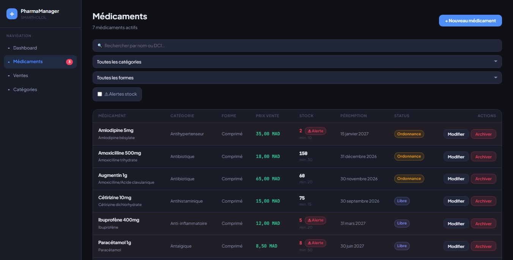
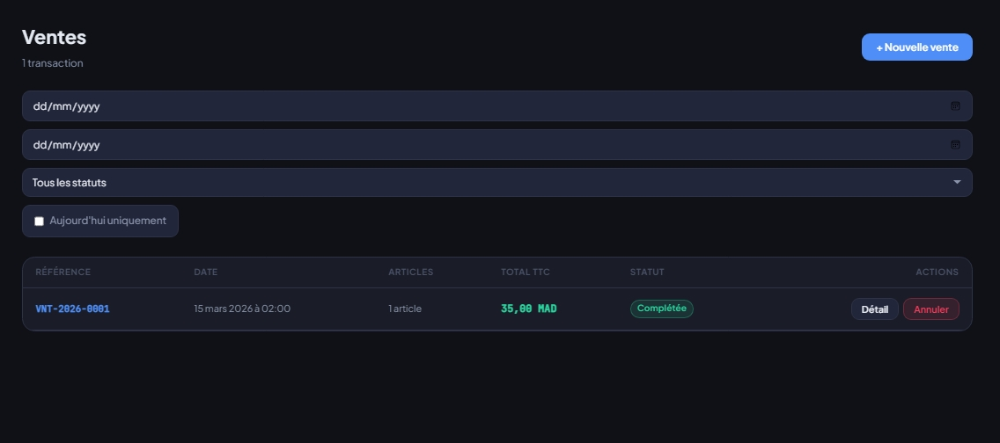
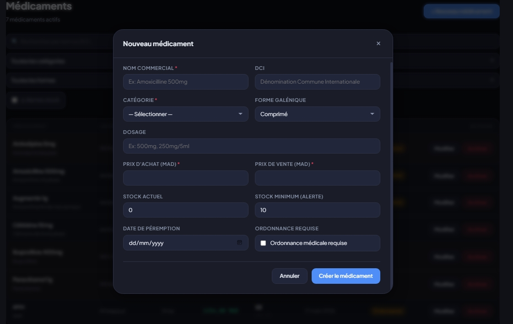
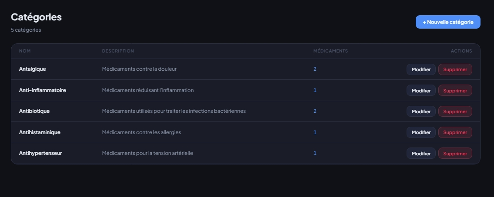
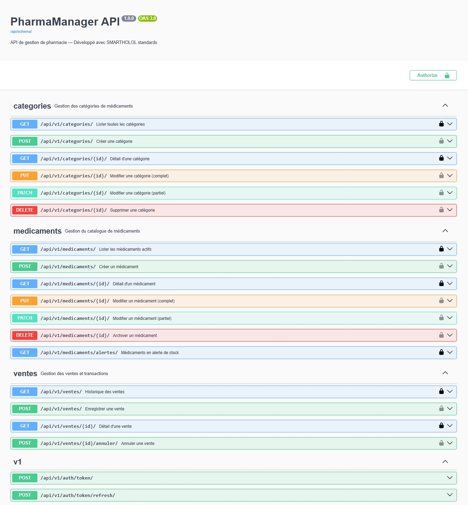
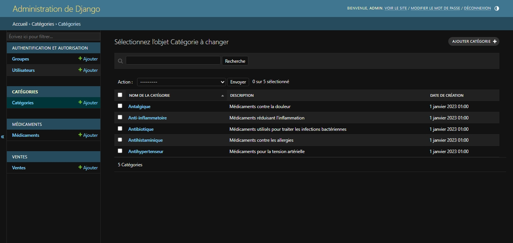

# PharmaManager

Application de gestion de pharmacie — Développé dans le cadre du test technique **SMARTHOLOL**

## Stack Technique

| Couche | Technologies |
|--------|-------------|
| Backend | Django 4.2 · Django REST Framework · PostgreSQL |
| Frontend | React 18 · Vite · React Router v6 · Axios |
| API Docs | Swagger UI via drf-spectacular |
| Auth | JWT (djangorestframework-simplejwt) |
| Bonus | Docker Compose · django-filter |

---

## Lancement rapide avec Docker Compose (recommandé)

```bash
git clone <repo-url> pharma-manager
cd pharma-manager
docker-compose up --build
```

- **Frontend** → http://localhost:5173  
- **Backend API** → http://localhost:8000/api/v1/  
- **Swagger UI** → http://localhost:8000/api/schema/swagger-ui/

---

## Installation manuelle

### Prérequis

- Python 3.10+
- Node.js 18+
- PostgreSQL 14+

### Backend

```bash
cd backend

# Créer et activer l'environnement virtuel
python -m venv venv
source venv/bin/activate        # Linux / macOS
# venv\Scripts\activate         # Windows

# Installer les dépendances
pip install -r requirements.txt

# Configurer les variables d'environnement
cp .env.example .env
# → Éditer .env avec vos paramètres PostgreSQL

# Appliquer les migrations
python manage.py migrate

# Charger les données de test
python manage.py loaddata fixtures/initial_data.json

# (Optionnel) Créer un superuser admin
python manage.py createsuperuser

# Lancer le serveur
python manage.py runserver
```

### Variables d'environnement Backend (`.env`)

```env
DEBUG=True
SECRET_KEY=votre-secret-key-ici
DB_NAME=pharma_db
DB_USER=postgres
DB_PASSWORD=votremotdepasse
DB_HOST=localhost
DB_PORT=5432
CORS_ALLOWED_ORIGINS=http://localhost:5173
```

### Frontend

```bash
cd frontend

# Installer les dépendances
npm install

# Configurer les variables d'environnement
cp .env.example .env
# Contenu : VITE_API_BASE_URL=http://localhost:8000/api/v1

# Lancer le serveur de développement
npm run dev
```

---

## Documentation API

Swagger UI disponible sur : **http://localhost:8000/api/schema/swagger-ui/**

### Endpoints principaux

| Méthode | Endpoint | Description |
|---------|----------|-------------|
| GET | `/api/v1/medicaments/` | Liste paginée des médicaments actifs |
| POST | `/api/v1/medicaments/` | Créer un médicament |
| GET | `/api/v1/medicaments/{id}/` | Détail d'un médicament |
| PATCH | `/api/v1/medicaments/{id}/` | Modifier un médicament |
| DELETE | `/api/v1/medicaments/{id}/` | Soft delete |
| GET | `/api/v1/medicaments/alertes/` | Médicaments en alerte stock |
| GET | `/api/v1/categories/` | Liste des catégories |
| POST | `/api/v1/categories/` | Créer une catégorie |
| GET | `/api/v1/ventes/` | Historique des ventes |
| POST | `/api/v1/ventes/` | Enregistrer une vente |
| GET | `/api/v1/ventes/{id}/` | Détail d'une vente |
| POST | `/api/v1/ventes/{id}/annuler/` | Annuler une vente |
| POST | `/api/v1/auth/token/` | Obtenir un token JWT |
| POST | `/api/v1/auth/token/refresh/` | Rafraîchir le token |

---

## Structure du projet

```
pharma-manager/
├── backend/
│   ├── config/
│   │   ├── settings/
│   │   │   ├── base.py        # Settings communs
│   │   │   └── local.py       # Settings développement
│   │   ├── urls.py
│   │   └── wsgi.py
│   ├── apps/
│   │   ├── categories/        # CRUD catégories
│   │   ├── medicaments/       # CRUD médicaments + alertes stock
│   │   └── ventes/            # Ventes + annulation + stock
│   ├── fixtures/
│   │   └── initial_data.json  # Données de test (5 catégories, 6 médicaments)
│   ├── requirements.txt
│   ├── .env.example
│   └── manage.py
│
├── frontend/
│   └── src/
│       ├── api/               # Couche d'accès API (axiosConfig, medicamentsApi…)
│       ├── components/
│       │   ├── common/        # Button, Modal, Badge, FormField, Spinner…
│       │   ├── medicaments/   # MedicamentTable, MedicamentForm, MedicamentFilters
│       │   └── ventes/        # VenteTable, VenteForm, VenteDetail
│       ├── hooks/             # useMedicaments, useVentes, useCategories, useAlertes
│       ├── pages/             # DashboardPage, MedicamentsPage, VentesPage, CategoriesPage
│       └── utils/             # formatters.js
│
├── docker-compose.yml
└── README.md
```

---

## Fonctionnalités implémentées

### Backend
- ✅ Modèles avec relations, contraintes et migrations
- ✅ Soft delete sur les médicaments (`est_actif`)
- ✅ Endpoint `/alertes/` — médicaments sous seuil minimum
- ✅ Création de vente avec déduction automatique du stock
- ✅ Annulation de vente avec réintégration du stock
- ✅ Référence auto-générée `VNT-YYYY-XXXX`
- ✅ Snapshot du prix au moment de la vente
- ✅ Filtres avancés avec `django-filter`
- ✅ Pagination sur tous les endpoints de liste
- ✅ Documentation Swagger complète via `drf-spectacular`
- ✅ Authentification JWT
- ✅ Variables d'environnement via `python-decouple`

### Frontend
- ✅ Dashboard avec KPIs, alertes stock, ventes du jour
- ✅ Page médicaments avec filtres, recherche, formulaire CRUD
- ✅ Page ventes avec création multi-articles, historique, annulation
- ✅ Page catégories avec CRUD complet
- ✅ Gestion des états `loading` et `error` sur chaque requête
- ✅ Toasts de confirmation pour chaque action
- ✅ Sidebar avec compteur d'alertes en temps réel
- ✅ URL API depuis variable d'environnement (`VITE_API_BASE_URL`)

### Bonus
- ✅ Docker Compose (lancement en une commande)
- ✅ Authentification JWT
- ✅ Filtres avancés avec `django-filter`

---

## Captures d'écran

### Tableau de bord

*Vue d'ensemble avec indicateurs clés et alertes stock.*

### Médicaments

*Interface de gestion des médicaments avec filtres, recherche et actions (modifier / archiver).* 

### Ventes

*Historique des transactions avec total TTC, statut et actions de détail/annulation.*

### Formulaire création / modification de médicament

*Modalité de création ou mise à jour d'un médicament.*

### Catégories

*Gestion des catégories avec compteur du nombre de médicaments par catégorie.*

### Documentation API (Swagger)

*Interface Swagger pour explorer et tester l'API (authentification JWT possible).* 

### Administration Django

*Page d'administration Django avec gestion des catégories, médicaments et ventes (requiert connexion superuser).* 

---

## Lancer les tests

Les tests utilisent SQLite en mémoire — aucune base PostgreSQL requise.

```bash
cd backend

# Activer l'environnement virtuel
source venv/bin/activate

# Lancer tous les tests
python manage.py test apps --settings=config.settings.test -v 2
```

### Couverture des tests

| App | Tests | Ce qui est testé |
|-----|-------|-----------------|
| `categories` | 7 tests | CRUD complet, unicité du nom, validation longueur |
| `medicaments` | 9 tests | Propriétés, soft-delete, alertes, filtres, validation prix |
| `ventes` | 12 tests | Création, déduction stock, total, snapshot prix, annulation, atomicité, filtres |

**Total : 28 tests unitaires**

Résultat attendu :
```
Ran 28 tests
OK
```

---

*Développé par HEBBAJ SIF-EDDINE — Test technique SMARTHOLOL v1.0*
